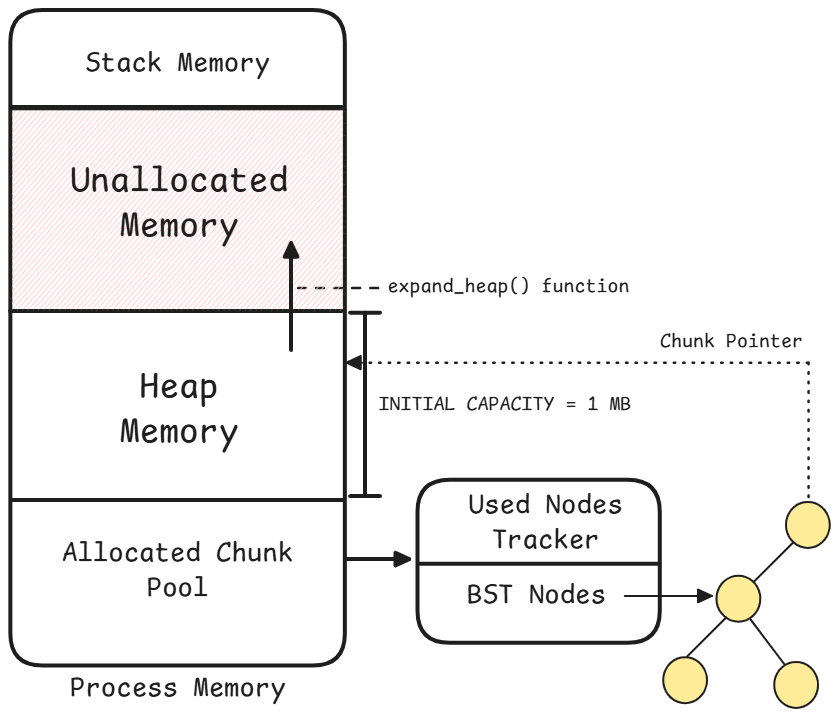

# Dynamic Heap Memory Allocator
### By Tirthraj Mahajan

This project is a custom memory allocator in C++ from scratch designed to manage memory with fine control and efficiency. 
It implements chunk-based memory management using a best-fit allocation strategy and a binary search tree (BST) to track free chunks by size. We leverage the sbrk system call to manage heap space, providing dynamic expansion and shrinkage of memory as needed.

To reduce internal fragmentation, our allocator coalesces adjacent free chunks, combining them into larger blocks. 
This coalescing strategy optimizes memory usage by preventing small, unusable chunks from scattering across the heap, ensuring more contiguous memory blocks are available for future allocations. 
The allocator also provides a custom allocate_new function that uses templates and placement syntax, allowing for efficient object construction within allocated memory.


## Strategies Used

1. **Chunk-based Memory Management**: Memory is divided into chunks, each managed by metadata containing allocation status, size, and neighboring chunk information for merging.
2. **Best-Fit Allocation**: To reduce fragmentation, the allocator searches for the best-fitting free chunk that matches the requested size.
3. **Binary Search Tree (BST)**: A BST is used to organize free chunks efficiently by size for allocation and by pointer for deallocation, optimizing memory access.

---

## Project Structure

The project’s structure includes header files, implementation files, and a main entry point to compile and run the allocator.

```
root
├── includes
│   ├── allocator.h         # Header for Allocator class, containing main allocation methods
│   ├── chunk_metadata.h    # Header for Chunk_Metadata class, tracking chunk data
│   └── bst_node.h          # Header for BST_Node class, managing BST nodes for chunk management
│
├── lib
│   ├── allocator.cpp       # Implementation of Allocator class functions
│   ├── chunk_metadata.cpp  # Implementation of Chunk_Metadata functions
│   └── bst_node.cpp        # Implementation of BST_Node functions
│
├── src
│   └── main.cpp            # Main entry point, testing memory allocation and deallocation
│
├── CMakeLists.txt          # CMake build configuration
└── Dockerfile              # Docker configuration to run on non-Linux systems
```

---

## Running the Project

### Requirements
This project uses `<unistd.h>`, a library primarily available on Linux systems. 

#### For Linux Users
1. Build the project:
   ```bash
   mkdir build
   cd build
   cmake ..
   make
   ./MemoryAllocator
   ```

#### For Other OS Users
Use Docker to run the project:
1. Build and run the Docker container:
   ```bash
   docker build -t cpp_application .
   docker run -it --name allocator -v .:/app cpp_application
   ```

---

## Examples

### Example 1: Basic Memory Allocation
**Title**: Allocating and Deallocating Memory

**Description**: This example demonstrates allocating memory for an integer array and then deallocating it.

**Code**:
```cpp
#include "allocator.h"

int main(){
	Allocator& alloc = Allocator::getInstance();		        // Get the instance of allocator 
	int* int_arr = (int*)alloc.allocate(sizeof(int) * 10);		// Allocate 10 integers in heap
	
	for (int i = 0; i < 10; i++) {
		int_arr[i] = i;
	}

	for (int i = 0; i < 10; i++) {
		std::cout << int_arr[i] << " ";
	}
	std::cout << std::endl;

	alloc.deallocate(int_arr);
}
```

**Output**:
```
0 1 2 3 4 5 6 7 8 9
```

**Explanation**: The allocator requests space for 10 integers, prints allocation details, and then successfully deallocates the memory.

### Example 2: Create and Destroy Object
**Title**: Implementation of 'new' and 'delete' keyword

**Description**: This example demonstrates how to create and delete custom objects

**Code**:
```cpp
class MyClass {
public:
	MyClass(std::string param) {
		std::cout << "My Class Constructor called" << std::endl;
		std::cout << "Param passed : " << param << std::endl;
	}

	~MyClass() {
		std::cout << "My Class Destructor called" << std::endl;
	}

	void foo() {
		std::cout << "My Class function called" << std::endl;
	}
};


int main(){
	Allocator& alloc = Allocator::getInstance();
	MyClass* myclass_ptr = alloc.allocate_new<MyClass>("Param 1");
	myclass_ptr->foo();
	alloc.free_ptr<MyClass>(myclass_ptr);
}
```

**Output**:
```
My Class Constructor called
Param passed : Param 1
My Class function called
My Class Destructor called
```

**Explanation**: Use the `allocate_new()` method to instantiate a new object. Pass the parameters as the arguments to the constructor

### Example 3: Enable DEBUG Mode
**Title**: Turn on DEBUG Mode

**Description**: To see the internal logs and working, and use the `heap_dump()` function and `print_allocated_chunks()` function, enable DEBUG Mode

**Code**:
```cpp

int main(){
	bool DEBUG_MODE = true;
	Allocator& alloc = Allocator::getInstance(DEBUG_MODE);
	
	int* int_arr = (int*)alloc.allocate(sizeof(int) * 10);		// 40 Bytes
	char* char_arr = (char*)alloc.allocate(sizeof(char) * 26);  // 26 Bytes

	// expected to have 2 chunks -> int_arr and char_arr
	// int_arr chunk = 10*sizeof(int) + 32 (sizeof(Chunk_Metadata)) = 10*4 + 32 = 40 + 32 = 72 bytes
	// char_arr chunk = 26*sizeof(char) + 32 (sizeof(Chunk_Metadata)) = 26 + 32 = 58 bytes

	alloc.heap_dump();
	alloc.print_allocated_chunks();

	// let us free int_arr. It should free -> 10 * sizeof(int) = 10*4 + 32 = 40+32 = 72 bytes
	alloc.deallocate(int_arr);

	// now if we look at heap dump, we will see that chunk 1 is free and allocated_chunk tree should only have one chunk inside of it
	alloc.heap_dump();
	alloc.print_allocated_chunks();

}
```

**Output**:
```

---------- getInstance() Logs ---------- 

[INFO]    INITILIZATING NODE POOL..

[INFO]    INITILIZATING HEAP..

[INFO]    INITIAL HEAP CAPACITY 1048576

[INFO]    Chunk Metadata Size : 32

[INFO]    Heap initialized at heap_start : 0x55bfcbe1f400 with capacity of 1048576

---------- END ---------- 

---------- int_arr Creation Logs ---------- 
[INFO]    Received Allocation Request for 40

[INFO]    Creating first chunk

[INFO]    Received Request for inserting node in BST: root=0 chunk_ptr=0x55bfcbe1f420 chunk_size=40

[INFO]    Received request for node allocation: size=40 chunk=0x55bfcbe1f420

[INFO]    Node: i=0

[INFO]     node_pool=0x55bfcbe17000

[INFO]     node_used=0

[INFO]    Found free node

---------- END ---------- 

---------- char_arr Creation Logs ---------- 
[INFO]    Received Allocation Request for 26

[INFO]    Received Request for inserting node in BST: root=0x55bfcbe17000 chunk_ptr=0x55bfcbe1f468 chunk_size=26

[INFO]    Received Request for inserting node in BST: root=0 chunk_ptr=0x55bfcbe1f468 chunk_size=26

[INFO]    Received request for node allocation: size=26 chunk=0x55bfcbe1f468

[INFO]    Node: i=0

[INFO]     node_pool=0x55bfcbe17000

[INFO]     node_used=1

[INFO]    Node: i=1

[INFO]     node_pool=0x55bfcbe17020

[INFO]     node_used=0

[INFO]    Found free node
---------- END ---------- 

-- PRINTING ALLOCATED CHUNKS --

      0x55bfcbe1f448 : 26

0x55bfcbe1f400 : 40

---------- END ---------- 

---------- int_arr deallocation logs ---------- 
[INFO]    Received request for deallocation of pointer 0x55bfcbe1f420

[INFO]    Verification Done:  0x55bfcbe1f420 is valid

[INFO]    Pointer found in allocation tree
 ptr=0x55bfcbe1f420
 chunk_ptr=0x55bfcbe1f420
 bst_chunk_node=0x55bfcbe1f400

----------------------------------------
Heap Dump:
Total Heap Capacity: 1048576 bytes
Used Heap Size: 130 bytes
Chunks:
Chunk at: 0x55bfcbe1f400, Size: 40 bytes, Free, Next: 0x55bfcbe1f448, Prev: 0
Chunk at: 0x55bfcbe1f448, Size: 26 bytes, Allocated, Next: 0, Prev: 0x55bfcbe1f400
Summary:
Total Allocated Memory: 26 bytes
Total Free Memory: 40 bytes
Number of Allocated Chunks: 1
Number of Free Chunks: 1
----------------------------------------
-- PRINTING ALLOCATED CHUNKS --

0x55bfcbe1f448 : 26
---------- END ---------- 
```

**Explanation**: The logs contain the information about the working our the entire project. In the `main.cpp` file, there are few more examples that show the best fit stratergy and coalescing strategy.

---

## How It Works Internally



### `brk` and `sbrk` System Calls
The allocator uses the `sbrk` system call, which adjusts the program's data space by changing the program break location. By controlling `sbrk`, the allocator directly manages memory allocation outside of the standard C++ heap allocation (e.g., `new` or `malloc`), giving granular control over the memory lifecycle.

### Chunk Allocation Pool and BST Organization
The allocator creates a pool of chunk pointers of allocated chunks managed by a binary search tree (BST). Each chunk has metadata, stored in `Chunk_Metadata`, that tracks the chunk's size, allocation status, and neighboring chunks. 
- **Pointer-based Search**: When deallocating, the BST uses the pointer to locate chunks quickly, allowing efficient deallocation.

### Memory Allocation and Deallocation Process
1. **Allocation**: The allocator searches for an available chunk that best matches the request size using the BST.
   - If no matching chunk is found, `sbrk` is called to expand the heap and create a new chunk.
2. **Deallocation**: The allocator deallocates a chunk and merges it with neighboring free chunks if possible, optimizing memory utilization.

### The `allocate_new` Function
The allocator uses the `allocate_new` function to allocate objects with constructor calls. It combines templates and the `placement new` syntax to directly construct objects in allocated memory without extra allocation overhead. This function exemplifies low-level memory management while providing flexibility to allocate custom object types efficiently.

### The `free_ptr` Function   
The allocator uses the `free_ptr` function to destroy the object pointed by the pointer. It first, calls the destructor and then makes the memory as free

---
